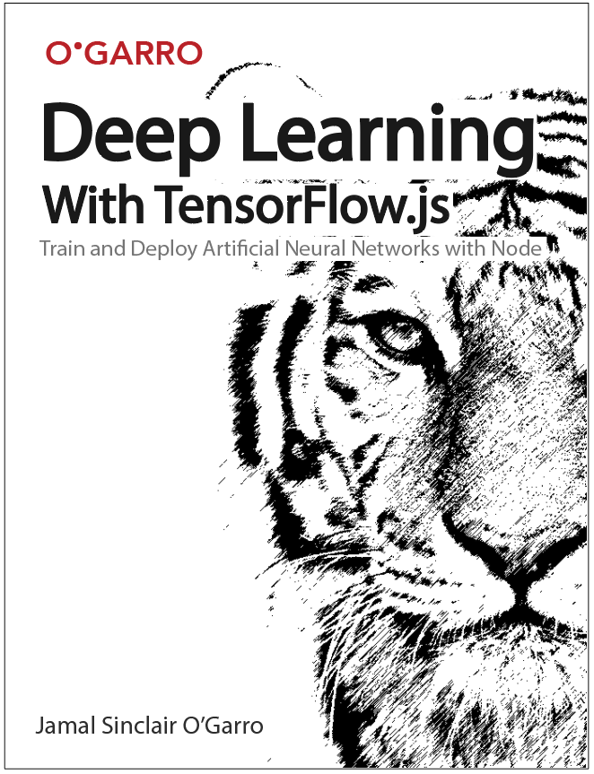

# Deep Learning with TensorFlow.js

> Train and deploy deep learning models in the browser using artificial neural networks, Node and TensorFlow.js

Copyright, Jamal Sinclair O'Garro 2018 - 2020

## Important Note About the Status of this Book

This book is currently a work in progress. I am writing it in the open to allow others to review and comment as I work to complete it. I am a big believer in open source software so I think it makes sense for more books on software development, computer science, artificial intelligence and machine learning to be written in an open source manner. 

Originally, I was writing this book with a publisher; however, I decided to self-publish it since I was simultaneously writing another book with a different publisher and did not have the time to complete both manuscripts within the time constraints I was given. I think this is a good thing because both publishers had very aggressive deadlines (both gave me less than six months to complete both books) but this was a lesson for me to learn as a first-time author. Now that I can publish this book on my own terms and on my own timeline I can take the time to present the material in way that I think would benefit readers the most.

I plan to spend a couple of hours a week completing these chapters so note that they are very rough and are in their beginning stages. However, you should feel free to read them and provide feedback as you see fit by opening an issue on GitHub. Contributions are also welcome. The contribution instructions appear in [CONTRIBUTING.md](./CONTRIBUTING.md). I plan to credit every contributor that contributes to the book.

## Table of Contents

- Acknowledgements

- About This Book

- About the Author

- Chapter 1: Introducing TensorFlow.js

- Chapter 2: Installation and Environment Setup

- Chapter 3: Modern JavaScript and Node.js

- Chapter 4: Artificial Neural Networks

- Chapter 5: Your Very First Deep Learning Model

- Chapter 6: Understanding the TensorFlow.js Core API

- Chapter 7: Understanding the TensforFlow.js Layers API

- Chapter 8: Importing and Running Existing Models in the Browser

- Chapter 9: Deploying Deep Learning Models to the Browser

- Chapter 10: Next Steps in Deep learning

- Glossary

## Target audience

This book is aimed at front-end and full stack software developers that are interested in learning how to use TensorFlow.js to embed machine learning and deep learning models in the browser. Little to no experience with Artificial Intelligence, Machine Learning or Deep Learning is required though some familiarity with JavaScript and web technologies is recommended.

## Long Description

We currently live in an age where data is more abundant than ever before in human history. This increase of data has caused a machine learning revolution that rendered ideas that were once limited by theory to be used in everyday applications. The current saying is that data is the new oil and many companies have changed their business operations in such a way that they are built around gathering and learning from data.

This increase in interest for collecting more data has led to the rise of embedded machine learning algorithms in the applications that we use on a daily basis. For example, every time you check the ETA for directions in Google Maps or Uber a machine learning algorithm estimates how long it will take for you to arrive at your destination. When you sign into Netflix and are recommended a movie to watch or when you are recommended similar products to purchase on Amazon it’s probably an artificial neural network coming up with suggestions behind the scenes.

To properly process the massive amounts of data that are currently being collected by today’s tech enabled businesses a large amount of computing is required. As a result the development, deployment and inference done by machine learning models has traditionally been done on the server. However, this can prove to be expensive for models that must update themselves in real-time when receiving feedback from the user since it may require a round trip to the server. With Google’s recent release of TensorFlow.js we can build and deploy simple machine learning models in the browser or load existing models to use for inference and even retrain these models with new data directly in the browser.

In this book we will learn the basics of artificial neural networks and deep learning. Specifically we will learn how to develop and deploy deep learning models in the browser leveraging the power of artificial neural networks. In particular, we will use Google’s popular open source high performance numerical computation library, TensorFlow.js, to add the power of machine learning algorithms to our front-end applications.

## What You Will Learn

In this book readers will learn the fundamental building blocks of deep learning and how to use TensorFlow.js to construct artificial neural networks to create machine learning and deep learning models. Your journey will begin by learning about the history of TensorFlow.js as well as the basics of deep learning and artificial neural networks. We will then explore the TensorFlow.js Core and Layers APIs and learn how they can be used to develop artificial neural networks and deep learning models. You will then learn how to perform inference and retrain existing models in browser after receiving additional data from the end user. Last we’ll learn how to deploy the front-end of an application containing embedded TensorFlow models to the Internet and how to optimize it for production use. We will implement several fundamental deep learning models as we learn each of these topics.

## Approach

In this book we will learn just enough TensorFlow.js to build and deploy deep learning models to the web. Each chapter will focus on a section of the TensorFlow.js API after completing a short primer on artificial intelligence and deep learning. Readers will learn how to use both the Core and Layers APIs to develop deep learning models. The chapters are presented in a tutorial style where each chapter builds off of what was learned in the previous chapter. This book has been organized in such a way that each chapter can also serve as a quick reference for a particular topic.

## Author Bio

Jamal Sinclair O’Garro is a full-stack Node.js and Python developer with experience working at several bulge-bracket investment banks and asset management firms including Goldman Sachs and Morgan Stanley, BlackRock Financial Management, a multi-billion dollar hedge fund and a major securities market maker. His primary focus is designing and building electronic trading software systems. Jamal has both written and deployed deep learning models that have been used in the systematic, semi-systematic and algorithmic trading programs.

Jamal is also heavily involved in the NYC tech scene and runs two of New York City's largest tech meetups. He has been invited to and has spoken at the President Barrack Obama's White House, the United Nations and New York University. Jamal has been featured or quoted in media outlets such as Fortune, Forbes, TechCrunch and CNN/Money. In his spare time he likes to shoot photography, learn new functional programming languages, give tech talks and teach others how to code. He has taught software engineering and web development courses at the New Jersey Institute of Technology and Columbia University in the City of New York.

Jamal currently lives in in the suburbs of New York City in beautiful Westchester County with his loving wife and soulmate, Felicia.
