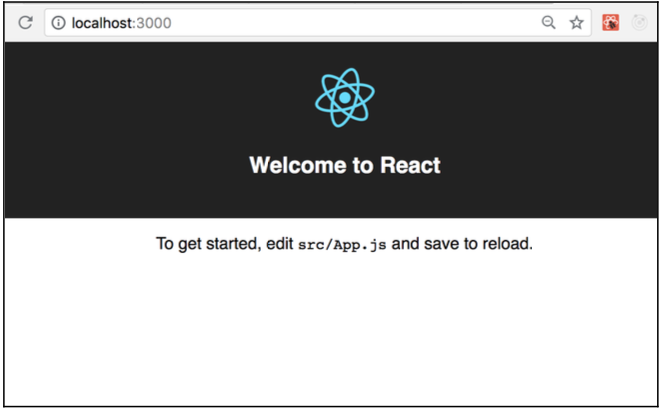

# Chapter 2: Installation and Environment Setup

In the previous chapter we covered the TensorFlow project and provided a brief history of how TensorFlow.js grew out of this and another project called deeplearning.js at Google. In chapter two we will cover how to setup a Node.js development environment that is suitable for developing and training machine learning models in the browser. A brief outline of this chapter is as follows:

- Learn the different ways that we can load Tensorflow.js into the browser
- Install Node.js and the Node package manager (npm) on your computer
- Discover npm and how it can be used to create and manage dependencies in a development environment
- Use create-react-app to set up a professional front-end development
  environment consisting of Babel, Webpack and React
- Install TensorFlow.js and write a simple program that allows us to create and train a machine learning model and use it to perform inference in the browser

## Simple installation

TensorFlow.js can be installed in a couple of different ways. In this book we will cover two. To ease the load we'll begin with the quickest way to get started using the TensorFlow.js library, which is to simply embed a script tag that contains an external link to the library in an HTML. This is demonstrated in the following example:

**Figure 2.1**

```html
<html>
  <head>
    <script src="https://cdn.jsdelivr.net/npm/@tensorflow/tfjs@0.12.5"></script>
  </head>
  <body>
    ...
  </body>
</html>
```

When the web page containing the sample markup above loads, the script tag will make a request to the JSDelvr content delivery network (CDN) and load version 0.12.5 of the TensorFlow.js library into the browser for use. Any other script tag loaded after the one that injects the TensorFlow.js library will have access to TensorFlow.js through a global object. This global object is accessed through the "tf" namespace and contains the methods that provide the functionality required to use TensorFlow.js to build and train models in the browser. In the next example, found in Figure 2.2, we can see the the “tf” object being used to create a model, add a layer to this model, compile the model and then use it to predict values.

**Figure 2.2**

```html
<html>
  <head>
    <!-- Load the TensorFlow.js library from a remote CDN -->
    <script src="https://cdn.jsdelivr.net/npm/@tensorflow/tfjs@0.12.5"></script>
    <!-- Script tag containing our custom code -->
    <script>
      // Define a model for linear regression.
      const model = tf.sequential();
      model.add(tf.layers.dense({ units: 1, inputShape: [1] }));
      // Compile the model for trainining.
      model.compile({ loss: "meanSquaredError", optimizer: "sgd" });
      // Prepare our data.
      const xs = tf.tensor2d([2, 4, 6, 8], [4, 1]);
      const ys = tf.tensor2d([2, 6, 10, 14], [4, 1]);
      // Train model with the data create in the previous step
      model.fit(xs, ys, { epochs: 10 }).then(() => {
        // Perform inference on new data and print the result.
        model.predict(tf.tensor2d([5], [1, 1])).print();
      });
    </script>
  </head>
  <body></body>
</html>
```

Don’t worry too much about the code snippets in the example above. We will cover this in more detail later in this chapter.

### Introducing the Node Package Manager

Installation and Environment Setup Chapter 1
The second way to install TensorFlow.js is via npm, also known as the Node Package Manager. If this is your first time hearing about npm, it is essentially a software registry that contains JavaScript and Node.js libraries. It is currently the world’s largest software registry and boasts approximately 3 billion downloads per week and contains an astonishing 600,000 packages at the time of this writing. You can think of packages as how JavaScript and Node libraries are bundled for distribution. In short, a package is just a directory that contains one or more files. In this directory we usually find a file called package.json, which contains metadata about the particular package that is being distributed.

Npm consists of three main components:

- The npm website
- The npm Command Line Interface (CLI)
- The npm registry

The npm website is npm's home on the Internet. It is a website that we can visit to get more information about npm, its latest developments and search for packages to install into our projects.

The npm CLI is a program that runs in your terminal. It can be downloaded to a computer and allows us to install packages locally to a project or globally on our machines, keep track of project dependencies or define and run scripts. We will be using the npm CLI to install TensorFlow.js in a later section of this chapter.

## Node.js

Node.js is a JavaScript runtime build on Google Chrome's V8 JavaScript engine. You can view it as a JavaScript runtime environment that provides access to the operating system so that we can write and execute JavaScript programs that run on the server. Though the focus of this book is on building machine learning models to be run in the browser we require Node.js for our development environment as we will be using it to install dependencies and build our JavaScript programs that we will run in the browser.

JavaScript was originally created to run in the browser and natively has no support for interfacing with the user's operating system. Node.js adds this functionality to JavaScript to allow developers to perform I/O operations, build web servers and create modules that can import and export their dependencies. Node brings the power of JavaScript down to the machine level and provides the ability to write programs consisting of command-line scripts, web servers as well as web and mobile applications. This brings JavaScript into the same playing field as other multi-purpose scripting languages such as Python and Ruby in terms of its capabilities. However, the fact that Node.js is event-driven and non-blocking we can create programs that are significantly faster than the two languages mentioned. Taking a deep dive into Node.js and its non-blocking, event-driven model is out of the scope of this book. Just know that we will require it to install our environment dependencies and build the machine learning models and browser applications that will serve as learning examples in this book.

## Installing Node

Installing Node.js is slightly different depending on the operating system you plan to install it for. Luckily for use the Node Foundation provides detailed instructions on how to get Node up and running on your particular operating system whether it be Windows, Linux or macOS.

To get Node running on your machine it is as simple as visiting `https://nodejs.org/en/download/` and downloading the appropriate installer for your operating system. On this page you will find installation programs for additional platforms including the official Node.js Docker image under the Additional Platforms section. You also have the option of downloading the source directly. The rest of this chapter will continue under the assumption that you have successfully installed Node.js on your computer using the official installers found on the official Node.js site and this is recommended way to install the software on your computer.

> Note: I would recommend either using the Docker image if you are familiar with Docker or downloading the installer for your operating system and walking through the setup wizard instructions.

> Note: Node comes in two versions, Long Term Support (LTS) and Current. The Node Foundation recommends enterprise users use LTS while users that want the most recent stable release of the platform can use the Current version to take advantage of the latest features.

### Installing npm

The npm Command Line Interface program come packaged with Node.js when you install it from the Node.js homepage. However if you want to upgrade to the latest version you can run the following command in your terminal: `npm i -g npm`

Next we can run the following commands to create a new NPM project in a directory called hello_tfjs:

```bash
mkdir hello_tfjs

cd hello_tfjs

npm init
```

After running the last command you will be presented with an interactive prompt that will ask you a series of questions about your project. For the purposes of this tutorial it's ok to accept the defaults by clicking Enter at each prompt. After completing the setup you will see a new file called package.json in the root of your hello_tfjs directory. This file contains metadata about your project including the dependencies that we will be adding as we continue through this chapter.

## Compiling Code with Babel and Webpack

The examples in this book will leverage ES2017 syntax including module imports. Unfortunately, many of the latest features of the JavaScript spec are not currently implemented in Node most notably module imports and exports. However, we can use additional software to allow us to use the latest features of the JavaScript language today. In order to take advantage of the these powerful new features we will use two tools that are popular in the JavaScript web development space: Babel and Webpack.

Babel is a JavaScript compiler that allows us to write modern-day JavaScript (i.e. ES2017 and feature proposals) and compile the code down to a version of JavaScript that will run across all browsers. Webpack is a package bundler that will compile all of our code into a single optimized script that can be run in the browser and allow us to use ES2016 module imports and exports. Webpack will also create a development web server for us that can be used to view our application in the browser and automatically reload it as we implement new features.

The Babel and Webpack modules can be installed separately; however, we are going to bypass installing them individually because it can be a bit of work to setup Babel and Webpack for new projects. To get a production Babel and Webpack environment for free we are going to use the create-react-app project, which has been developed and open sourced by Facebook.

## A Note About React.js

We use the create-react-app module because it makes it easy for us to create a React development environment for developing production web applications. React is a popular JavaScript library that is used to create rich view components that can be composed to build web applications.

React uses a virtual representation of the DOM that allows developers to declaratively build user interfaces by composing functions that return JavaScript objects that represent virtual DOM elements. The finer details of React are out of the scope of this book but we will use its JSX markup language as a way to quickly build web pages that run machine learning models in the browser. If you are familiar with HTML then JSX will be pretty easy to understand. All examples of markup will be provided for you and you can simply copy and paste them into your text editor or IDE of choice.

We will use the create-react-app project to quickly develop our sample applications in this book. If you would like to learn more about React and how it can be used to build highly scalable web applications feel free to read through the library’s documentation, which can be found at https://reactjs.org/docs/getting-started.html.

## Installing Create React App (CRA)

To get a fully working React JavaScript web development environment we can run the following command from the command line:

```bash
npm i create-react-app
```

This will install the create-react-app project locally to your project. To create a new project run the following commands:

```bash
npx create-react-app tfjs
```

The command above will create a new JavaScript project with Babel, Webpack and React preconfigured and place the files required to run this project in a directory called tfjs. Run the next set of commands to change into this directory so that we can run a few additional commands to compile and launch the app.

```bash
cd tfjs
```

And to launch the application run the following commands:

```bash
npm i

npm start
```

This will install all of the required dependencies required to run out application as well as start Webpack, compile our code through Babel and spin up a live hot-reloading development server that will run on localhost:3000 in our browsers. You’ll see the application running if you visit http://localhost:3000/ in your browser.

If you see the following screen the installation was successful and you're now ready to install and start using TensorFlow.js in the browser!

**Figure 2.3**



## Installing TensorFlow.js via npm

If we visit the npm website at https://npmjs.com we can search for TensorFlow.js by typing “tfjs” into the search box and clicking enter or we can navigate directly to the package page via this link https://www.npmjs.com/package/@tensorflow/tfjs. On the package homepage you will find the following information about the package:

- how many dependencies it has its software license
- the number of weekly downloads
- last publish date
- links to its Github repository

Under the install section you will see the command that we can use to install TensorFlow.js to your computer. Let's run it from the command line inside of our tfjs directory:

`npm i @tensorflow/tfjs`

The command above uses the npm CLI with the flag “i”, which is short for install, to install the latest stable version of TensorFlow.js. The CLI will make a request to the npm registry and install the latest version, as described on the Tensforflow.js npm page, and install it locally on your computer in a folder called `node_modules`.
The node_modules folder is where npm installs all dependencies that you have installed via npm CLI npm i command. Any module saved to node_modules can be required in any JavaScript file via ES2016 imports, which are transpiled by Webpack in our development environment.

To try out TensorFlow.js change the code found in tfjs/src/App.js (this file was created for us by create-react-app in the previous steps) by copying and pasting the following code into it. Don't worry too much about how the code works for now. We will explain this in much more detail in a later chapter. For now it is recommended to follow along with the comments that are present in Figure 2.4 below:

**Figure 2.4**

```javascript
// tfjs/src/App.js - import dependencies
import React, { Component } from "react";
import * as tf from "@tensorflow/tfjs";

class App extends Component {
  runModel = () => {
    // Define a model for linear regression.
    const model = tf.sequential();
    model.add(tf.layers.dense({ units: 1, inputShape: [1] }));
    // Compile the model for training.
    model.compile({ loss: "meanSquaredError", optimizer: "sgd" });
    // Prepare our data.
    const xs = tf.tensor2d([2, 4, 6, 8], [4, 1]);
    const ys = tf.tensor2d([2, 6, 10, 14], [4, 1]);
    // Train model with the data create in the previous step
    model.fit(xs, ys, { epochs: 10 }).then(() => {
      // Perform inference on new data and print the result.
      model.predict(tf.tensor2d([5], [1, 1])).print();
    });
  };
  render() {
    this.runModel();
    return (
      <div className="App">
        <h1>TensorFlow.js Quick Start Guide</h1>
        <p>Check the console for model result.</p>
      </div>
    );
  }
}

export default App;
```

A little bit about how this code works:

1. When our script loads we create a sequential model and add a layer to it
2. We specify a particular shape and compile our model for our training step
3. We next prepare our data that we eventually train and predict a result and print it to the console as specified in the print method specified in the callback in the model.fit call

This is an over-simplified explanation of how this code works but it will do until we go deeper into the machine learning theory and TensorFlow.js APIs.
After replacing the contents of App.js with the snippet above navigate to http://localhost:3000 in your browser and launch Chrome Development Tools JavaScript console by pressing Cmd + Shift + C.

When your browser loads the URL the script created by Webpack is loaded in the browser the JavaScript that we wrote in our App.js file will be executed and we can expect the result of our model to be printed to the console. If all was successful you should see a TensorFlow.js Tensor object—the result of our model prediction—printed to the console. Your resulting value may be different but that's ok at this point of the tutorial. The most important part is that you receive a Tensor as your console output. An example is displayed in Figure 2.5:

**Figure 2.5**

```bash
Tensor
    [[8.3426971],]
```

## Summary

Congratulations! You have successfully set up a working TensorFlow.js development environment. In this chapter we installed Node.js and leveraged npm to install several environment dependencies including create-react-app, which we used to set up a front-end web development environment composed of React, Babel and Webpack. We finally installed TensorFlow.js into our project and used it to recreate a simple model that performs inference when given an input and prints the result to the JavaScript console.

In the next chapter we will provide an introduction to the theory of Machine Learning and Artificial Neural Networks. This chapter will help us build the intuition required to understand how TensorFlow works to further help us build ANNs and use these structures for building models that can help us make powerful predictions in the browser.
