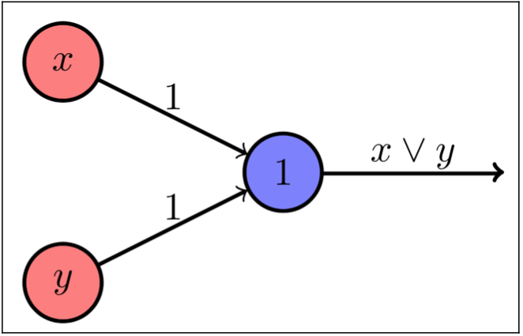
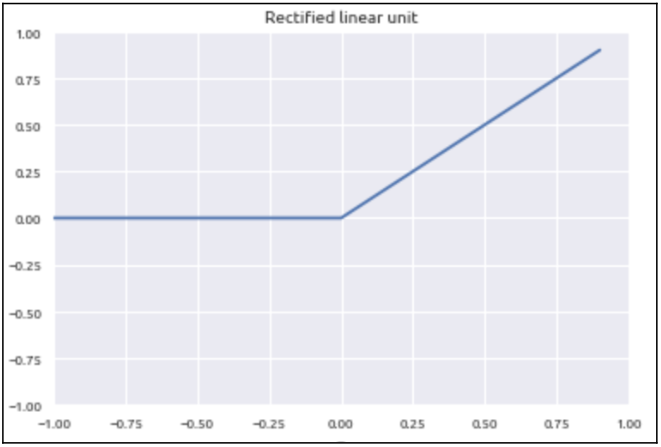
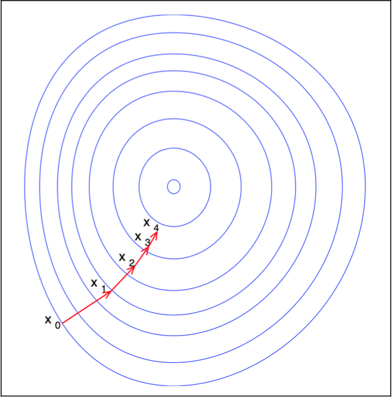

# Introduction to Artificial Neural Networks

In the last chapter we setup our Node.js and TensorFlow.js development environment and ran a “hello world” of sorts. In this chapter we will delve deeper into machine learning theory in order to develop the intuition required to build deep learning models with TensorFlow.js.
To accomplish this we will cover the following topics:

- Understand how deep learning relates to machine learning and artificial intelligence
- Cover the differences between supervised and unsupervised learning
- Review artificial neural networks, their components and how they are used to perform inference
- Discuss how to train an ANN
- Look at different activation functions, cost functions and loss minimization algorithms we can use to train our models
- Understand the problems of overfitting and underfitting as well as how to address them

## Machine Learning

Machine Learning is the practice of using algorithms to gain insight from a data set, learn from this data set and then make some kind of prediction from the data. The key point here is that the program is able to learn from the data that it is given. Rather than writing a program that attempts to create the impression of being intelligent by anticipating and a series of edge cases and coding actions based on the user interaction.

Take chatbots for example. In the early days developers building a chatbot to order pizza would create a program that may look like the pseudo code shown as follows:

**Figure 3.1**

```
// pseudo code for a pizza delivery chatbot

print(“Hello, thanks for calling PizzaBot! How may I help you?”)

user_input = “some user response”

if user_input == “I would like to place an order” or “I would like a pizza for delivery”:
    print(‘Sure, I can help with you that. Press 1 for pizza, 2 for other menu items or 3 for condiments. Please note that you can talk to a real human being by pressing 0 at any time’)

user_input = 1 // this comes from the user

if user_input == 1:
    print(“The available pizza sizes are small, medium and large. Please say 1 for small, 2 for medium and 3 for large”)

user_input = “some response from the user”

if user_input:
    print(“Would you like toppings on your pizza? Select 1 for yes or 2 for
no.”)

if user_input === 1:
    // continue with the toppings selection flow
if user_input == 2:
    // try to upsell other items
if user_input == 2:
    // kick off the other menu items flow
if user_input == 3:
    // kick off the condiments flow
if user_input == 0:
    // forward user to a real human
else:
    print(‘Sorry, I did not understand your input’)
```

The example above starts off as what appears to be a simple block of code. After all, all we are doing is inviting the user to create an order while we attempt to take the user through different order flows based on their responses to certain questions. However, as we get into actually ordering the meal, which could consist of multiple pies, other menu items and different kinds of drinks the pizza could have been prepared and ready for delivery. By the time the user completes the flow, assuming there were no misunderstanding between your intentions and the computer program you could have your pizza order completed in about ten minutes tops. Maybe our example is a little too basic and it would probably be smarter to check for certain keywords rather than matching on entire sentences but you get the idea that trying to write a program that handles all of the edge cases that can occur in human speech would be a pretty lofty task for any skilled programmer.

In the field of machine learning, we do not try to anticipate edge cases since there can be many different ways to say "I would like to order a pizza." Human beings are used to having the experience of naturally expressing ourselves by talking to a human rather than to a machine. A modern approach, leveraging machine learning, would train a model to understand a user’s intent by learning to classify them from a data set containing the many different ways that a user can complete the flow. For example, the model would understand the sentence "I'd like two pepperoni pies" and "Give me two pies with pepperoni" as having the same intent and can decide to take the user to next part of the flow without defaulting to a message similar to "Sorry, I did not understand your request" if the user does not respond with an answer that matches a case the developer programmed for.

Machine Learning usually consists of three major types of learning :

- Supervised learning
- Unsupervised learning
- Reinforcement learning

> Note: In this book we will use the terms algorithm, model, neural net, net or ANN but they all refer to the same thing.

## Supervised Learning

A model that learns through the process of supervised learning learns and makes inferences (inferences are another name for predictions) on data that has been pre-labeled.
You can think of this like receiving the answers for an example and studying the questions. When you actually sit for the exam you get new but similar questions to the ones you studied for and you can use what you’ve learned from your studies to correctly answer the questions on the example. The more you study, the more questions you'll see, and the higher the probability of you getting the correct answer for new questions you haven't seen before. This a lot like how supervised learning works in machine learning.

A good example of this is the photo tagging feature that is popular with many social media applications. The way that your favorite photo sharing app is able to recognize photos of you, your friends and family works very similar to the process described above. When you upload photos to the cloud you are more than likely providing some machine learning model a data set, which in this case is your photos. If you elect to tag yourself and your friends in these photos you are providing labels for the model work with. Once the model has seen enough photos of you, your aunt May and uncle Ben it will have enough data to automatically recognize a new picture of you or a family member and tag it. We will be building a simplified version of a similar model in a later chapter of this book.

In effect, one is trying to map a set of inputs to a set of desired outputs. Here we have two major cases: classification, where the possible outputs are categorical, say one wants to know what type of person one is looking at from facial features. If the options are young, medium or old, then we have 3 classes. If the output is the number of years, we are dealing with regression. Of course one could argue, we can have 100 classes, or even 200, nobody lives more than that. Sure than say the output is the number o seconds, or milliseconds, that is prohibitive in the number of classes needed to represent the output space. Thus we treat it like a continuous output. In practice, classification has one output neuron for each class. When one specific class is determined, the specific output neuron is 1 and all others are 0. Whereas regression has one output which can take any value. Of course we can have multi-dimensional regression, say we want number of seconds and length of hair in micro-meters, then we would have 2 continous output neurons.

In terms of types of models, we have two major distinct tracks: parametric and non-parametric models. Say we have seen some fruits, we learned their names (in supervised learning we always have a training set, where we know labels, this is the supervision) and now we are facing a new fruit for which we have to give the name. Say we built our model to take into account the radius and color of the fruit and that's it. If it's blue and small is a blueberry, big and red is an apple. The current one is kind of small and greenish, might be an undeveloped prune. This is a parametric model, in the sense that we completely describe our model by a finite set of parameters. Whereas in non-parametric models, we recall what we have seen, this is similar to a blueberry and a prune, we are now looking at actual samples we have seen before and usually computing distances between data points. This is not to say that our model does not have parameters, it does (e.g. in what space are we computing distances) but the model decision is given by looking again at already seen data. In parametric models, data is seen and then completely summarized by the parameters, in non-parametric ones there is no such summarization. Neural network are parametric models, whereas SVM and k-NN are non-parametric.

## Unsupervised Learning

If a model is able to learn from the data and create its own labels we refer to this process as unsupervised learning. If we take our example of the social photo sharing application from above we can take the initial upload of photos.

Imagine that you uploaded 2,000 photos to this social media site. Though the model doesn’t know who you are or who the other people in your photos are, it can start to recognize faces and apply its own labels to the data before you even begin to label them by tagging them. Behind the scenes the model will create categories for people that look like you and people that look like uncle Ben, people that look like aunt May and so and so on.
This process of automatically making inferences from unlabelled data is called unsupervised learning (i.e. it doesn’t have the answers upfront and learns the features and classifies them without assistance). Of course it will not know the name of each person, but it can assign an index or some sort of label. What it learns is that uncle Ben is different than aunt May and you are similar in all photos. So then when you've tagged even a single photo of yourself, it can extend that label to the other photos that it knows are similar. This is a sort of semi-supervised learning. 

# Artificial Neural Networks

Artificial Neural Networks (ANN) are computing systems inspired by the human brain. The primary components of an ANN are neurons, connections, input layers, hidden layers and output layers. These are briefly explained below:
**Input layer**: Layer that contains our initial data that will flow through to other layers of neurons of processing (i.e. a list of a user's favorite films or watched films)

**Hidden layer**: A type of layer that sits between input and output layers and processes data. This processing comes in the form of weighted input that are passed through an activation function.

**Output layer**: The final layer of neurons that produces outputs for our neural network. This represents the result (i.e. is this a watched film or favourite film)

## Types of Neural Networks

This section will explain two important types of neural networks, which are the simple perceptron and multi-layered artificial neural networks. These are known as deterministic neural networks, there are also stochastic ones, like Deep Boltzmann Machines. This means that there is no uncertainty in their computation, if one feeds the same input twice, they will produce the same output both times. Whereas in stochastic neural networks, this is not so. 

### Perceptron

The simplest ANN is the Perceptron, which is a linear classifier that is used for binary predictions (i.e. predictions that fit into one of two categories). This simple ANN consists of an input layer consisting of our training data, a single hidden layer that takes our inputs, applies a weighted sum (i.e. multiplies the input with a vector of weights, so a dot product) and passes them through an activation function (which in this case is the identity function) to produce an output. We will be building a simple perceptron in the next chapter. An example of how this ANN looks is as follows:

**Figure 3.1**



### Multi-layered ANN

When data flows through a hidden layer its output is passed to the next layer for additional processing until it gets to the output layer. Each layer may have a particular function to perform. For example, an ANN that attempts to recognize images will contain a hidden layer with the sole purpose to recognize edges, while another layer's job is to detect eyes, another layer's job may be to detect lips and so and so on. The more layers added to an ANN the better it may or may not perform. ANNs containing a lot (tens, hundreds) of hidden layers are referred to as deep neural networks. This is also where the term deep learning comes from. An example multi-layered ANN appears as follows:

Figure 3.2


We’ll see that TensorFlow.js, particularly the Layers API, provides different kinds of layers for us to use out of the box when building our models.

## Activation Functions

The activation function of a given neuron defines the output of that neuron. In general, activation functions need to be differentiable, such that the gradient with respect to the weights exists, which is then used in the learning algorithm, the ubiquitous backpropagation. 

### Sigmoid Activation Function

The sigmoid activation function normalizes the input to some value that fits between 0 and 1. When plotted the graph of the line created takes the form of an S-shape that we call an sigmoid curve. The formula and plot are represented as follows:

**Figure 3.3 - Sigmoid Formula**


**Figure 3.4 - Sigmoid Formula Plot**


### ReLU Activation Function

ReLU is an activation function that returns 0 if our input is a negative value or its actual value if it is positive. The formula and plot appear as follows:

**Figure 3.5**


**Figure 3.6**



### Softmax Activation Function

The Softmax activation function is used for multi-class classification. This function normalizes a set of n values to a probability distribution (each is bigger than 0, and they all sum up to 1). These probabilities help us determine the class for inputs that are provided to our model. The formula appears below for further examination:

**Figure 3.7**


### Tanh Activation Function

An activation function similar to the sigmoid function is the Tanh function, or hyperbolic tangent. The tan-h function also follows an S-shape but the values range from -1 to 1. The formula and plot appear as follows:

**Figure 3.8**


There are other activation functions but these four are some of the most commonly used ones. What activation function we use for our layers depends on the type of data we are dealing with, how noisy the data is, etc. In general, the reLU are considered the best, they are also the youngest.

## Model Training

When we are training a machine learning model we are essentially solving an optimization problem where we are modifying the weights in each of our neurons to minimize a given loss/cost function, which we covered in the previous section. To minimize the costs in our models we usually chose an optimization algorithm (called optimizer in TensorFlow.js). The following sections provide a high level overview of the steps that are taken to train a model.

### Forward Propagation

Forward propagation is the process of providing our artificial neural network with input data that are applied weights (this is actually the process of multiplication), processed in a layer by an activation and output to the next layer for further processing. As explained in the previous sections, when our data reaches the final, or output, layer we receive a prediction from our model. The accuracy of our predictions depends on the set of weights that have been selected for our artificial neural network. As we continue feed our data forward through the model we may want to tweak our weights until we have an optimal set of values for our weights such that our predictions are as we desire. This process of tweaking our weights is called “training” our model.

### Cost Functions

In the previous section we mentioned that when training a model our goal is to try to find the optimal set of weights to apply to our data as it flows through the layers of our ANN. The better the sets of weights we use in our model the better the model will perform. A measure of the performance of our models is a cost function. The larger the cost the lower the quality of the predictions of our model. This means that the cost function is a measure of how wrong our model is when it attempts to estimate the relationship between inputs and outputs. Mathematically this is represented as some sort of contrast (can be a difference, but not only that) between our predicted values and the actual value.

When we train our model we are effectively minimizing the measure of the cost (also called loss) of our cost function. This is in essence the role of our model—to minimize the cost function until we have a model that can accurately predict values when given new input. This process of minimizing the cost function is called training the model and when the cost function decreases we say that the model is learning. We'll look at different techniques that we can use to minimize our costs but for now we look at a popular cost function, the mean square error.

### Mean Square Error

The mean square error of a model is the average of the squares of the errors in a model (i.e. the squared differences between our actual and predicted values). This measure is always positive and and provides us with information of the quality of our model. Figure 3.9 displays the formula:

**Figure 3.9**


### Gradient Descent

Previously we mentioned that models learn by minimizing a cost function. This process can be computationally expensive; however, there exists several algorithms that help achieve this goal in a more efficient manner. Gradient descent is an optimization algorithm that attempts to find the minimum (ideally global, but in general is local) of a function.
The first objective of gradient descent is to discern the direction the model move toward in order to reduce errors in our model. As explained above, these errors are for example the differences between our actual values and our predicted values. This equates to adjusting our model weights in a way such that the cost is minimized and the predictions become stronger.

Each time we pass through the model we adjust the weights so that the cost continues to decrease and our predictions begin to become more accurate. As we continue to move along our cost function we keep moving in the direction that minimizes the cost function until its output is zero. When we reached the point where the cost is zero we have optimized our model weights so that we minimize the cost function. 

The figure below demonstrates how gradient descent looks when graphed.

**Figure 3.10**



### Backpropagation

Gradient descent can be applied to any function which is differentiable with respect to its parameters. Gradient descent describes the actual process of moving in the opposite direction of the gradient (descent), which in neural networks is also known as backpropagation, in which one is effectively back propagating the error gradients up the network such that the overall cost function is minimized. The function to be evaluated is the objective function, the function for which we are trying to minimize the loss. We minimize the loss by computing the error gradients with respect to the weights and then propagating them up the network (we consider up where the input is, and down where the output is). We are never guaranteed to find a global minimum or maximum (maximum is a negative of minimum, they can be often interchanged in ML) in deep networks, but we usually do find some close to global, local optimum.

**Figure 3.11** (TODO: annotate this to show steps)


### Learning Rate and Epochs

It is important to note that there are two features that impact how quickly we find this global minima, if we ever find it at all. These two features are the learning rate and the epochs where the learning rate determines how large of a step we take as when we move in the opposite direction of the gradient, while the epoch is the number of times we will attempt to pass through the whole dataset. If we choose a too small learning rate then we might need a large number of epochs to reach a reasonably good local optima, if the learning rate is too large, then learning diverges, oscillates and we are constantly missing a good local optima.

An important relationship also exists between the number of epochs we choose in our learning process, which consists of a full forward pass (forward propagation) and backwards pass (backpropagation) through the whole dataset. The number of epochs and the batch size, that is the grouping of the datapoints for one single weight update, that is passed through the network can determine the effectiveness of the learning process. Remember that with each pass we adjust the weights of our artificial neural network, based on the data we have just seen and the error obtained. Using small batch size gives finer granularity of the weight updates but can be very slow, larger batch sizes are more easily parallelizable.

By determining the number epochs we decide how many times we would like to go through the dataset to update the weights in the process explained above. If we go through enough iterations with a small enough learning rate (or with a learning rate schedule) then we have a better chance of finding the global minima for our cost function and the optimal set of weights of our ANN. However, just like selecting a learning rate, selecting the number of epoch comes with a tradeoff. The more epochs selected and the larger the amount of data that has to pass through the artificial neural network the longer it will take to train our model and more resources may be required to train it.

### A Note on Overfitting

Overfitting occurs when the models does really well at classifying data in the training set but does poorly on new data that it has never been seen before. To visualize this take a look at figure 3.10, which shows what an overfitted model potentially looks like. We will not dive to deeply into this for the purposes of this book; however, we will include various techniques to identify and prevent overfitting.
One way to eliminate overfitting is to use a larger data set. The more data that is fed to a model the better it will perform in the training process. Another technique is to use data augmentation, in which we slightly change the data before training our model. For example, we can augment a set of images we plan to use for a facial recognition program by cropping some of images, rotating them or converting them from color to grayscale. We can also reduce the complexity of our model by dropping the number of layers for example, of our model to reduce overfitting. If we use a function that has too many degrees of freedom (is too complex) it can overfit our data set. Another technique that is used to reduce overfitting is dropout. What this does is randomly ignores (drops out) nodes out of the network to help the model better generalize about new data that it has never seen before.

**Figure 3.12**


### A Note on Underfitting

Underfitting occurs when a model does poorly performing inference on the data it was trained on. This happens when the model metrics are poor. For example, the cost is high or the accuracy is very low. Ways to improve model performance are to increase the complexity by changing the type of layer we’re using, the number of neurons in each layer or the number of layers themselves. Increasing the size of the data set will also help improve model performance. We can also add additional features. Another technique is to reduce the amount of dropout in the model. Figure 3.11 shows an example of what underfitting looks like graphically.

**Figure 3.13**


## Summary

In this chapter we were able to gain a very high-level overview of what deep learning is and how it fits into the grand scheme of the fields of Machine Learning and Artificial Intelligence. We took a dive into Artificial Neural Networks and their major components including the input, hidden and output layers. We then learned how ANNs are trained by minimizing a cost function. We learned the roles of activation functions and the process of backpropagation and gradient descent to minimize these costs. We also learned how the learning rate can impact our results. Last we identified the different types of Artificial Neural Networks.

In the next chapter we will take everything that we learned in this chapter and will use TensforFlow.js to build our first Artificial Neural Network.
